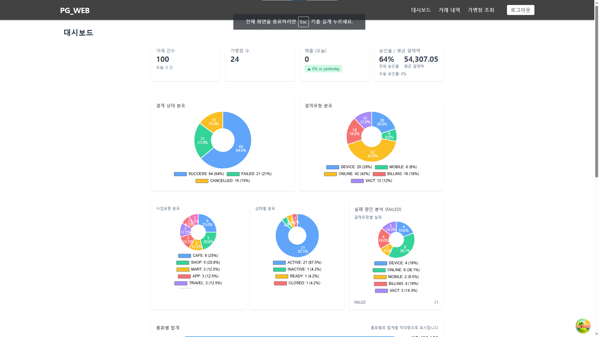
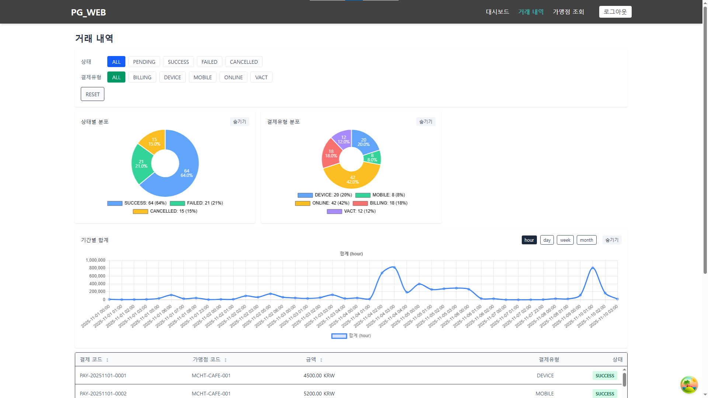
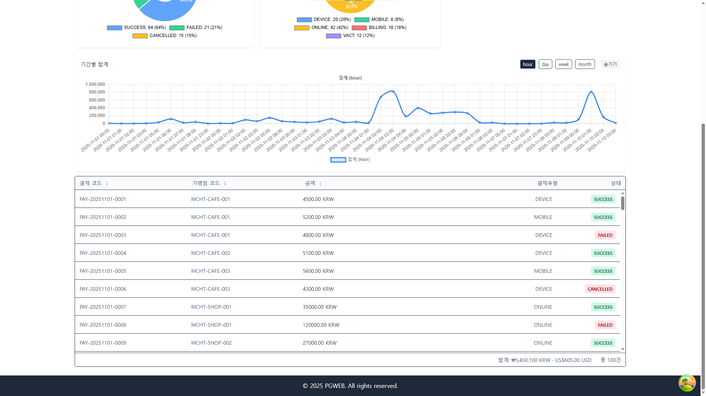
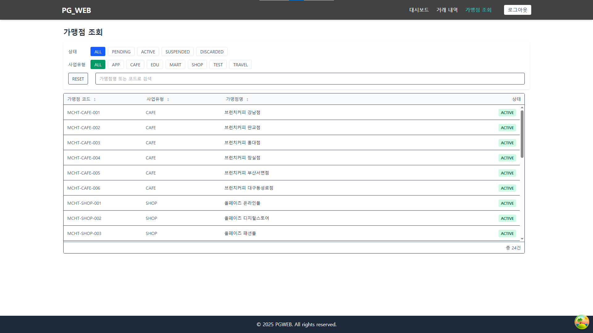

# PG_WEB

이 프로젝트는 [PG 도메인 관련 시스템]을 관리하는 웹 애플리케이션입니다. 사용자는 대시보드에서 중요한 통계를 확인하고, 거래 내역을 조회하고 관리할 수 있습니다. 또한, 가맹점 관리 및 거래 내역 정산 등의 기능을 제공합니다.

---

## 기술 스택

- **React**: UI 구성
- **TypeScript**: 정적 타입 검사
- **ReactQuery & Zustand**: 데이터 관리
- **Tailwind CSS(v4)**: CSS-in-JS 방식으로 스타일링
- **Axios**: HTTP 요청
- **Vite** : 번들링 도구
- **chart.js** : 그래프 시각화

---

## 설치 및 실행 방법

1. **프로젝트 클론**:

```bash
 git clone <프로젝트 URL>
```

2. **의존성 설치**:

프로젝트 디렉터리로 이동한 후 의존성을 설치합니다.

```bash
 npm install
```

3. **개발 서버 실행**:

```bash
 npm run dev
```

이후 브라우저에서 http://localhost:5173에 접속하여 웹 애플리케이션을 확인할 수 있습니다.

## 작업일지 및 특이 사항

- 일별 약 2.5~3 시간씩 5일에 걸쳐 완성

### Day1

Project init & 파일/폴더/프로젝트 구조 세팅 및 프로젝트 전체 구상  
Router 설정
Nav 설정
tailwind 테마분리
로그인페이지
특이사항 : taliwind v4(latest) 초기 설정 방법이 그 전 버전과 크게 달라짐

### Day2

api 기본 설정 및 컨셉 실증  
페이지별 api작성

### Day3

Payments, MerchantList Page 작성,
특이사항 : 대시보드 혹은 데이터의 최신화가 중요하다고 생각되어 ReactQuery를 사용하는데 페이지에 재접속할때마다 axios 요청을 보내면 store에 저장한 정보가 쓸모없는게 아닌가? 즉, store가 필요 없는 상태가 아닌가 의문
staleTime(데이터 폐기 시간)을 느리게 설정한다면 실시간성이 떨어지고, 백엔드와 협업이 가능하다면 Etag등의 도움을 받아 최신화를 하면 된다고 판단하여 일단 현재 구조(즉시 refetch)를 유지.

### Day4

대시보드 페이지 구상
그래프 디테일 수정 및 대시보드 페이지 레이아웃 작성

### Day 5

대시보드 페이지 완성(짧지만 가장 오래 걸렸습니다)

### 미흡했던 점

제작 기간이 짧아서 필터 및 쿼리 부분에서 재사용성과 추상화 정도가 떨어지는게 눈에 보임.
데이터 구조만 다르고 핵심 로직은 동일한데, 추상화 단계를 높여서 재사용했으면 어땠을까 함.

cursor pointer 등 UI/UX의 디테일이 떨어지는 부분이 다수 존재

---






